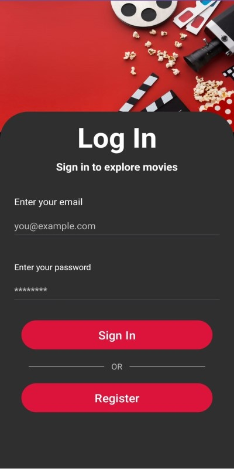
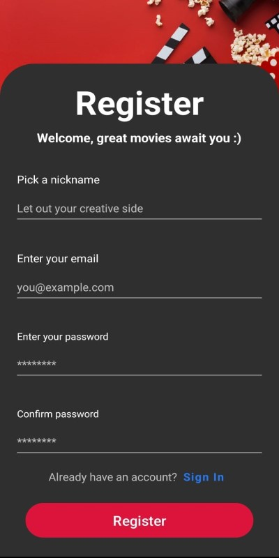
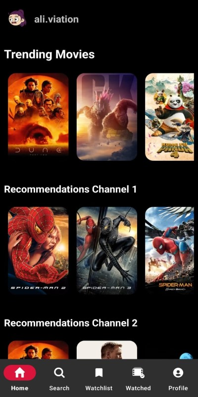
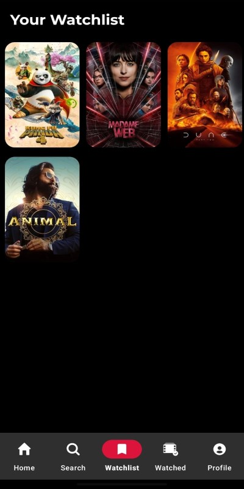
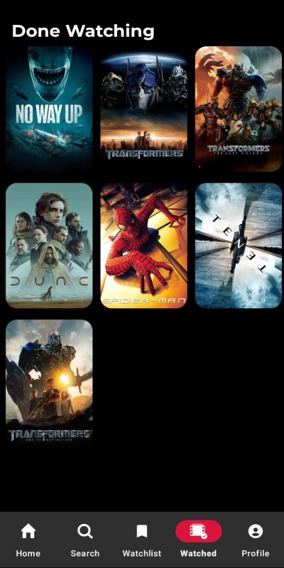
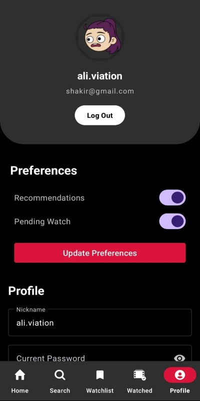

# MovieMate

A feature-rich, movie watchlist application made with Kolin with support for personal profiles, movie details, personalized recommendations, and more.
  

# Tech Stack

### Programming Language

- Android XML Layout(Kotlin)[https://kotlinlang.org/]
- Android XML Layouts

### Development Platform

- Windows 11 OS
- Android Studio 2023 IDE (Iguana) (https://developer.android.com/studio)

### Databases

- Firebase Firestore (https://firebase.google.com/products/firestore)
- The Movie Database (https://developer.themoviedb.org/)

### Other Tools:

- Figma for UI design (https://figma.com)
- UIZard for UIdesign using AI (https://app.uizard.io/prototypes)
- IconikAI for AI App Icon generation (https://www.iconikai.com/)

  

# Screenshots

### Login Screen

### Register Screen

### Home Screen

### Watchlist

### Done Watchlist

### Profile Screen

